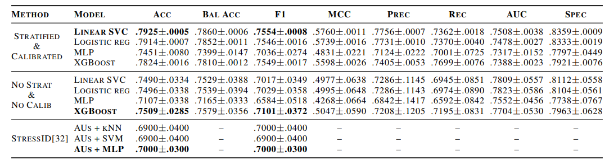
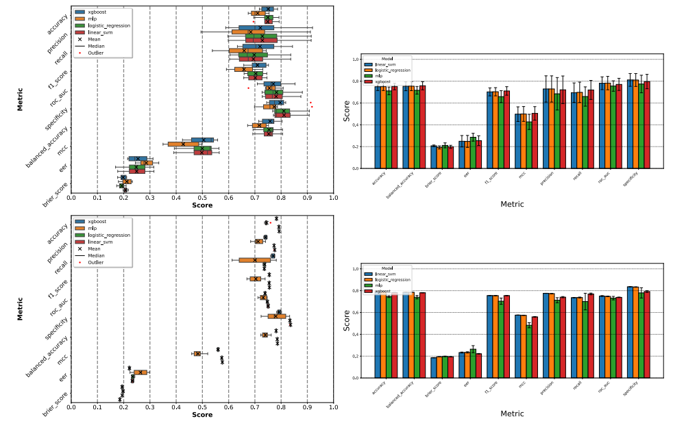
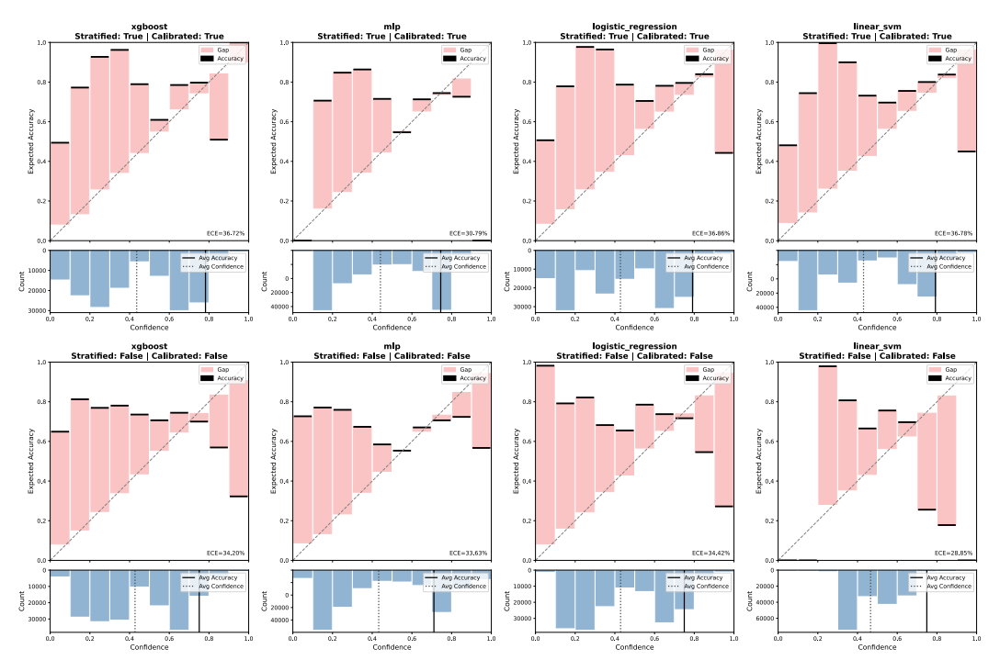

Exploratory Predictive Reliability in Facial-Image-Based Stress Detection: Subject-Wise Evaluation and Post-hoc Calibration
=============================================================================================================

Binary stress classification with ML from facial images using OpenFace 3.0 [1] as feature extractor of the Face Action Units (FAUs) and eye gaze with subject-aware splits and post-hoc probability calibration.

Paper: [**Exploratory Predictive Reliability in Facial-Image-Based Stress Detection: Subject-Wise Evaluation and Post-hoc Calibration**](https://arxiv.org/...)

BibTeX:
  ```
  @inproceedings{
  benavente-rios2026exploratory,
  title={Exploratory Predictive Reliability in Facial-Image-Based Stress Detection},
  author={David Benavente-Rios and Miguel Alejandro Rodr{í}guez Jara and H{é}ctor S{á}nchez San-Blas and Diego {M.} Jim{é}nez-Bravo},
  booktitle={TBD},
  year={2026},
  url={TBD}
  }
  ```


RESULTS
-------
The results are presented in the table bellow.



All metrics computed on the held-out test split (subjects unseen during training).

### Figures:

  
  **Figure 1**. Distribution of performance metrics across experimental runs. The upper panels correspond to the baseline protocol without stratification and calibration, whereas the lower panels correspond to the combined stratified, hyperparameter-optimised, and calibrated protocol. Box plots show variability across runs, and bar charts compare the mean performance of the four classifiers.

  
  **Figure 2**. Reliability diagrams for the four classifiers. The upper panels correspond to the combined stratified and calibrated protocol, whereas the lower panels correspond to the baseline protocol without stratification or calibration. The diagonal represents perfect calibration.


DATASET
-----------
In this work we used the video sub-set of the [StressID](https://project.inria.fr/stressid/) [2].


QUICK START
-----------

Prerequisites:
  - Python >= 3.12
  - uv (fast Python package manager)

1. Install uv

    ```
    curl -LsSf https://astral.sh/uv/install.sh | sh
    uv --version
     ```

2. Clone and create environment

    ```
     git clone https://github.com/271828D/uq-aware-stress-det stress-detection
     cd stress-detection
    ```
  - uv venv
     ```
     source .venv/bin/activate        # macOS / Linux
     .venv\Scripts\activate           # Windows (PowerShell)
     ```

3. Install dependencies
    ```
     uv pip install -e .
    ```

4. Configure data path

    - Edit configs/data/stress_data.yaml:
      ```
        data:
          source_file: "/absolute/path/to/your/data.csv"
      ```

5. Single training run
    ```
     uv run python src/train/trainer.py model=logistic_regression seed=42
     ```

6. Hyperparameter search (Optuna)

     Available for logistic_regression and random_forest only:
    ```
     uv run python src/train/trainer.py -m model=logistic_regression search_space=logistic_regression seed=42
     ```

     Sweep results are written to multirun/<model>/<timestamp>/optimization_results.yaml.

7. Retrain with best hyperparameters
    ```
     uv run python src/evaluation/test.py \
       hydra.mode=RUN \
       model=linear_svc \
       best_params="multirun/linear_svc/<timestamp>/optimization_results.yaml" \
       seed=42
    ```


CONFIGURATION REFERENCE
-----------------------

All parameters are Hydra-overridable from the CLI. Key groups:

  Group          | File                                | Notable keys
  ---------------|-------------------------------------|----------------------------------
  data           | configs/data/stress_data.yaml       | source_file, test_size, val_size
  model          | configs/model/<name>.yaml           | model_name, model-specific hyperparams
  search_space   | configs/search_space/<name>.yaml    | Optuna search ranges (used with -m)

Example: override a single hyperparameter without editing YAML:
  ```
  uv run python src/train/trainer.py model=logistic_regression model.C=10 seed=42
  ```


DEPENDENCIES
------------

  - Full pinned versions: see **pyproject.toml** or uv.lock.

  Package                 | Min Version | Purpose
  ------------------------|-------------|------------------------------------------
  scikit-learn            | 1.9.0       | Baseline models, metrics, calibration
  xgboost                 | 3.4.0       | Gradient-boosted trees
  hydra-core              | 1.3.5       | Config management
  hydra-optuna-sweeper    | 1.2.0       | Hyperparameter search
  weights-and-biases      | --          | Experiment tracking


LICENSE
-------

TBD -- see LICENSE for details.

REFERENCES
----------
[1] J. Hu, L. Mathur, P. P. Liang and L. -P. Morency, "OpenFace 3.0: A Lightweight Multitask System for Comprehensive Facial Behavior Analysis," 2025 IEEE 19th International Conference on Automatic Face and Gesture Recognition (FG), Tampa/Clearwater, FL, USA, 2025, pp. 1-11, doi: 10.1109/FG61629.2025.11099277.

[2] Hava Chaptoukaev, Valeriya Strizhkova, Michele Panariello, Bianca D'Alpaos, Aglind Reka, Valeria Manera, Susanne Thümmler, Esma Ismailova, Nicholas Evans, François Bremond, Massimiliano Todisco, Maria A. Zuluaga, and Laura M. Ferrari. 2023. StressID: a multimodal dataset for stress identification. In Proceedings of the 37th International Conference on Neural Information Processing Systems (NeurIPS '23).
